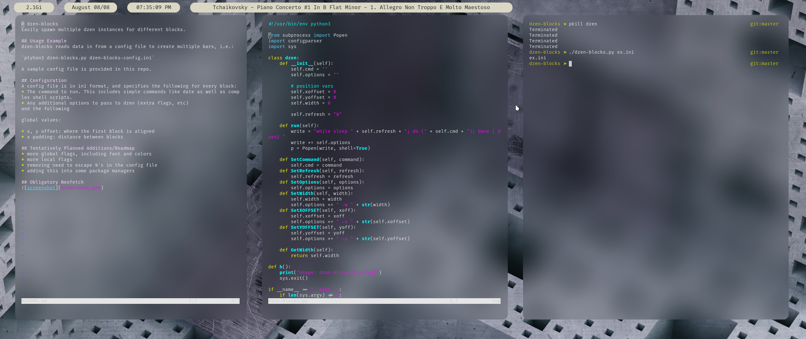

# dzen-blocks
Easily spawn multiple dzen instances for different blocks.

## Usage Example
dzen-blocks reads data in from a config file to create multiple bars, i.e.:

`ptyhon3 dzen-blocks.py dzen-blocks-config.ini`

A sample config file is provided in this repo.

## Configuration
A config file is in ini format, and specifies the following for every block:
* The command to run. This includes simple commands like date as well as complex shell scripts.
* Any additional options to pass to dzen (extra flags, etc)
and the following

global values:

* x, y offset: where the first block is aligned
* x padding: distance between blocks

## Tentatively Planned Additions/Roadmap
* Make this a daemon, it might work a bit better than the current process.
* more global flags, including font and colors
* more local flags
* removing need to escape %'s in the config file
* adding this into some package managers

## Obligatory Neofetch

